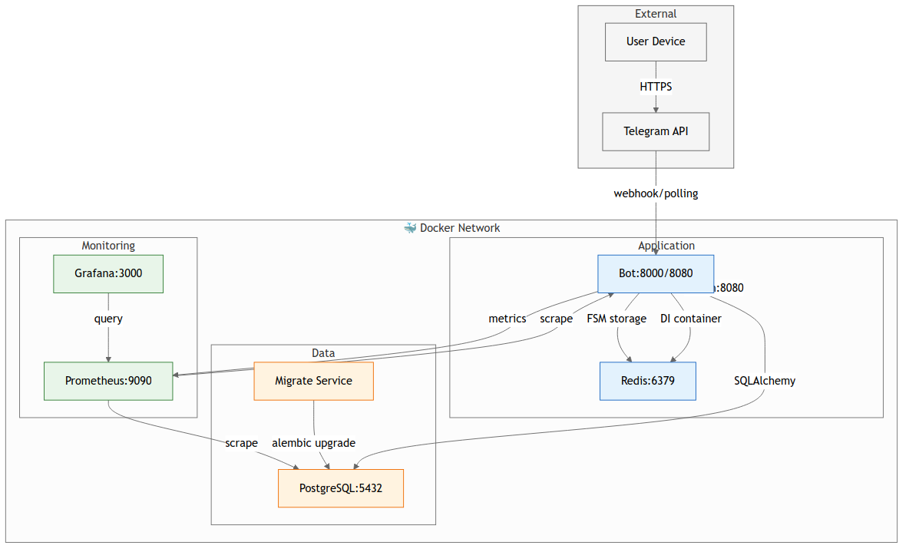

# 📓 Mood Diary — Телеграм-бот для отслеживания настроения

> Простой и приватный способ фиксировать своё эмоциональное состояние каждый день.

[](https://www.python.org/)
[](LICENSE)
[](https://www.docker.com/)
[](https://blog.cleancoder.com/uncle-bob/2012/08/13/the-clean-architecture.html)
[](https://github.com/ignavan39/mood_diary/stargazers)
[](https://github.com/astral-sh/uv)

---


## 📋 Оглавление
- [О проекте](#-о-проекте)
- [Поиск по проекту](#-поиск-по-проекту)
- [Быстрый старт](#-быстрый-старт)
- [Конфигурация](#️-конфигурация)
- [Структура проекта](#️-структура-проекта)
- [Поток данных](#-поток-данных)
- [Мониторинг](#-мониторинг)
- [Технологии](#-технологии)


## 📋 О проекте

**Mood Diary** — это телеграм-бот, который помогает пользователю раз в день оценивать своё настроение по шкале от **0 до 10**. Все данные сохраняются в базе, что позволяет отслеживать динамику эмоционального состояния, строить графики и анализировать паттерны.

### ✨ Возможности
- 🎯 Оценка настроения одним нажатием (шкала 0–10)
- 📅 Напоминание раз в день (настраиваемое время)
- 📊 Просмотр истории и статистики за неделю/месяц
- 🧱 Чистая архитектура: Domain → Repository → Infrastructure

---


## 🔍 Поиск по проекту

Этот репозиторий может быть полезен если ты ищешь:

- пример бота на aiogram 3.x
- шаблон Clean Architecture на Python
- интеграция Prometheus + Grafana для мониторинга
- асинхронный PostgreSQL с SQLAlchemy 2.0
- self-hosted решение для ментального здоровья
- телеграм бот для дневника настроения

---

## 🚀 Быстрый старт

### Требования
- Python 3.12+
- PostgreSQL 14+
- Docker и Docker Compose *(опционально, но рекомендуется)*
- Токен бота от [@BotFather](https://t.me/BotFather)

### 🐳 Запуск через Docker Compose (рекомендуется)

1. Клонируйте репозиторий:
```bash
git clone https://github.com/ignavan39/mood_diary.git
cd mood_diary
```

2. Создайте файл окружения `.env` в корне проекта:
```env
# Telegram
TG_BOT__TOKEN=your_telegram_bot_token_here

# Database
PG__USER=
PG__PASSWORD=
PG__HOST=
PG__NAME=
PG__PORT=

# App
TIMEZONE=Europe/Moscow
REMINDER_TIME=20:00

# Monitoring

GRAFANA_PASSWORD=
GRAFANA_USER=
```

3. Запустите сервисы:
```bash
docker compose up -d
```

4. Примените миграции:

в целом при сборке всех приложений запуститься образ migrate и накатит миграции сам
если требуется отдельно то:


```bash
docker compose exec app alembic upgrade head
```
или

```bash
docker compose up --build postgres migrate
```

5. Запустите бота и напишите ему в Telegram `/start`

### 💻 Локальный запуск (без Docker)

1. Установите зависимости (рекомендуется использовать `uv`):
```bash
# Если установлен uv
uv sync

# Или через pip
pip install -r <(uv export)
```

2. Создайте и настройте `.env` (см. пример выше).

3. Примените миграции:
```bash
alembic upgrade head
```

4. Запустите бота:
```bash
python -m src.main
```

---

## ⚙️ Конфигурация

Все настройки задаются через переменные окружения или файл `.env`.


## 🗂️ Структура проекта

```
mood-diary-bot/
├── README.md                     # Этот файл
├── src/
│   ├── main.py                   # Точка входа
│   ├── domain/                   # Domain слой
│   │   ├── entities/             # Бизнес-сущности
│   │   ├── repositories/         # Интерфейсы репозиториев
│   │   └── exceptions/           # Domain исключения
│   ├── application/              # Application слой
│   │   ├── use_cases/            # Бизнес-логика
│   │   └── dtos/                 # DTO для запросов/ответов
│   ├── infrastructure/           # Infrastructure слой
│   │   ├── database/             # SQLAlchemy, модели, репозитории
│   │   ├── ioc/                  # DI контейнер
│   │   └── configs/              # Настройки
│   └── presintation/             # Presentation слой
│       └── telegram/             # aiogram хендлеры
│           └── user/
│               ├── router.py     # Роутеры и хендлеры
│               └──  controllers/  # Контроллеры
├──monitoring/
|   └── grafana/
        ├──prometheus.yml     # Конфиг сбора метрик
│       └── provisioning/
│           ├── dashboards/
│           │   ├── dashboards.yml      # Конфиг авто-загрузки дашбордов
│           │   └── mood-diary.json     # Готовый дашборд с метриками
│           └── datasources/
│               └── prometheus.yml      # Подключение Prometheus
├── pyproject.toml           # Зависимости и метаданные проекта
├── uv.lock                  # Lock-файл зависимостей (uv)
├── alembic.ini              # Настройки Alembic
├── docker-compose.yml       # Оркестрация сервисов
├── Dockerfile               # Образ приложения
└── .env.example             # Шаблон переменных окружения
```

## 🔁 Поток данных
```
┌─────────────────────────────────────────┐
│ Presentation (Telegram handlers)        │
│ → зависит от Application                │
└─────────────────┬───────────────────────┘
↓
┌─────────────────────────────────────────┐
│ Application (Use Cases, DTOs)           │
│ → зависит от Domain                     │
└─────────────────┬───────────────────────┘
↓
┌─────────────────────────────────────────┐
│ Domain (Entities, Repository Interfaces)│
│ → НЕ зависит ни от чего                 │
└─────────────────────────────────────────┘
↑
┌─────────────────────────────────────────┐
│ Infrastructure (SQLAlchemy, aiogram)    │
│ → реализует Domain интерфейсы           │
└─────────────────────────────────────────┘
```



---
## 📊 Мониторинг

Папка `monitoring/` содержит конфигурацию Prometheus + Grafana:


### 📈 Что внутри:

| Компонент | Описание |
|-----------|----------|
| **Grafana dashboards** | Готовый дашборд с метриками бота (сообщения, ошибки, время ответа, пользователи) |
| **Prometheus config** | Настройка скрейпинга метрик с бота и PostgreSQL |
| **Auto-provisioning** | Дашборды и datasource подключаются автоматически при старте |

### 🔗 Доступ к интерфейсам:

| Сервис | URL | Логин/Пароль |
|--------|-----|--------------|
| **Grafana** | http://localhost:3000 | admin / admin123 |
| **Prometheus** | http://localhost:9090 | — |
| **Bot Metrics** | http://localhost:8000/metrics | — |

### 🚀 Быстрый старт:

```bash
# Запустить весь стек с мониторингом
docker compose up -d

# Открыть Grafana
open http://localhost:3000

# Дашборд появится автоматически через 30 секунд
# Dashboards → Browse → Mood Diary Bot
```

| Метрика | Тип | Описание |
|---------|-----|----------|
| `bot_messages_total` | Counter | Всего обработано сообщений |
| `bot_request_duration_seconds` | Histogram | Время обработки запроса |
| `bot_active_users` | Gauge | Активных пользователей за час |
| `bot_users_registered_total` | Counter | Всего зарегистрировано пользователей |

---

## 📦 Технологии

| Компонент | Технология | Зачем |
|-----------|-----------|--------|
| **Backend** | Python 3.12+, asyncio | Асинхронность, высокая производительность |
| **Bot Framework** | aiogram 3.x | Современный async-фреймворк для Telegram |
| **ORM** | SQLAlchemy 2.0 + asyncpg | Типизированные async-запросы к PostgreSQL |
| **Config** | Pydantic Settings | Валидация настроек, типизация, .env-поддержка |
| **Migrations** | Alembic | Управление схемой БД |
| **DI/Architecture** | Clean Architecture + Repository Pattern | Разделение слоёв, тестируемость |
| **Containerization** | Docker, Compose | Воспроизводимая среда, лёгкий деплой |
| **Package Manager** | uv *(или pip)* | Быстрая установка зависимостей |

---


## Код стайл

```
# Проверка типов
mypy src/

# Линтинг
ruff check src/ && ruff format src/
```

---

## ⭐ Понравился проект?

- Поставь звезду ⭐ — это лучшая поддержка!
- Расскажи другу 🗣️ — если считаешь полезным
- Предложи идею 💡 — через Issues или Discussions
- Исправь опечатку ✏️ — любой вклад важен

Спасибо что заглянул! 🙏

---


## 📄 Лицензия

Распространяется под лицензией MIT. Подробности — в файле [LICENSE](LICENSE).

---


> ⚠️ **Важно**: Этот бот не является медицинским инструментом. Если вы испытываете стойкое ухудшение настроения, тревогу или депрессивные состояния — обратитесь к квалифицированному специалисту.

---

*Сделано с заботой о ментальном здоровье 🌱*
