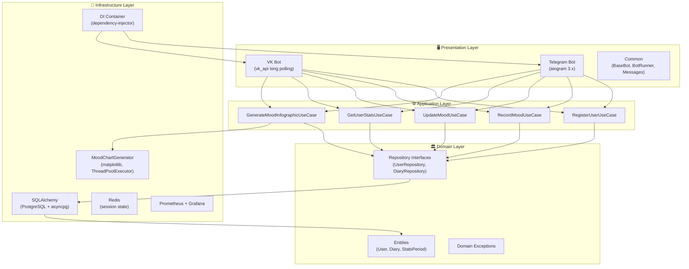
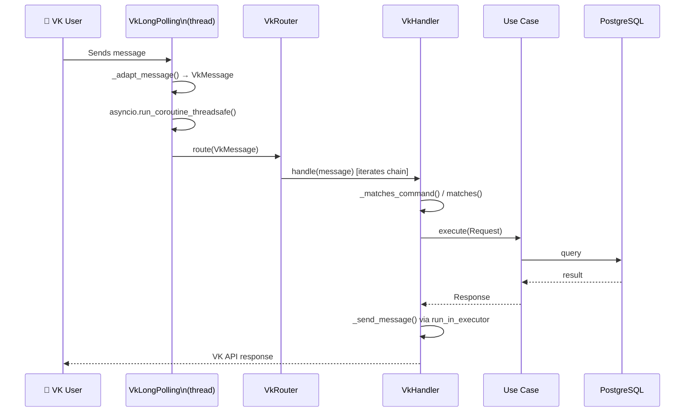
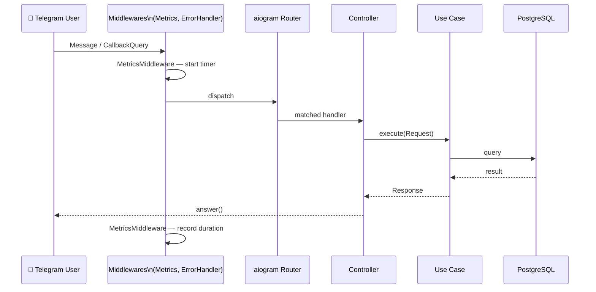
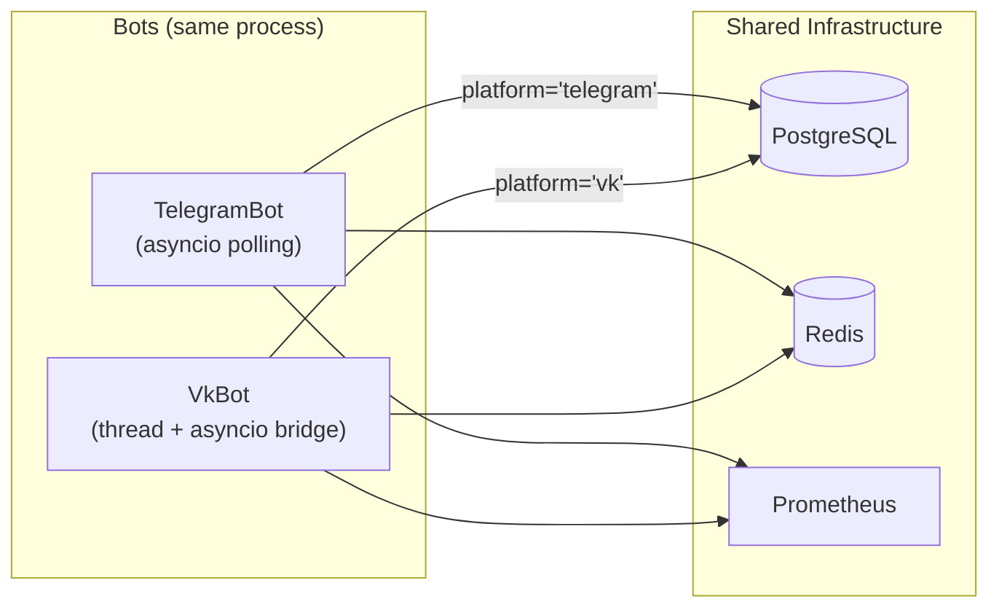
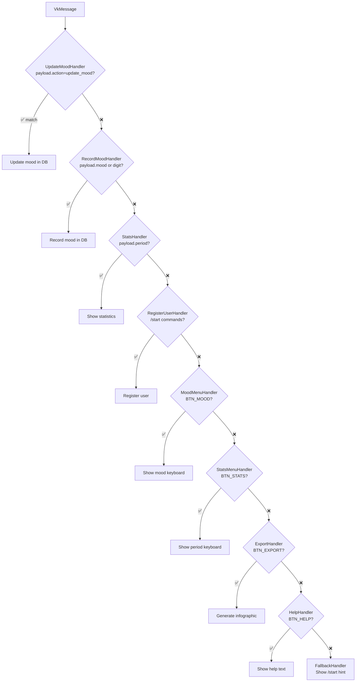

## Clean Architecture Layers

```mermaid
graph TB
    subgraph Presentation["🖥️ Presentation Layer"]
        TG["Telegram Bot\n(aiogram 3.x)"]
        VK["VK Bot\n(vk_api long polling)"]
        COMMON["Common\n(BaseBot, BotRunner, Messages)"]
    end

    subgraph Application["⚙️ Application Layer"]
        UC_REG["RegisterUserUseCase"]
        UC_MOOD["RecordMoodUseCase"]
        UC_UPD["UpdateMoodUseCase"]
        UC_STATS["GetUserStatsUseCase"]
        UC_EXP["GenerateMoodInfographicUseCase"]
    end

    subgraph Domain["🏛️ Domain Layer"]
        ENT["Entities\n(User, Diary, StatsPeriod)"]
        REPO_I["Repository Interfaces\n(UserRepository, DiaryRepository)"]
        EXC["Domain Exceptions"]
    end

    subgraph Infrastructure["🔧 Infrastructure Layer"]
        DB["SQLAlchemy\n(PostgreSQL + asyncpg)"]
        REDIS["Redis\n(session state)"]
        CHART["MoodChartGenerator\n(matplotlib, ThreadPoolExecutor)"]
        IOC["DI Container\n(dependency-injector)"]
        METRICS["Prometheus + Grafana"]
    end

    TG --> UC_REG & UC_MOOD & UC_UPD & UC_STATS & UC_EXP
    VK --> UC_REG & UC_MOOD & UC_UPD & UC_STATS & UC_EXP
    UC_REG & UC_MOOD & UC_UPD & UC_STATS --> REPO_I
    UC_EXP --> REPO_I & CHART
    REPO_I --> DB
    DB --> ENT
    IOC --> TG & VK
```

---

## VK Bot — Message Flow

```mermaid
sequenceDiagram
    participant User as 👤 VK User
    participant LP as VkLongPolling\n(thread)
    participant Router as VkRouter
    participant Handler as VkHandler
    participant UC as Use Case
    participant DB as PostgreSQL

    User->>LP: Sends message
    LP->>LP: _adapt_message() → VkMessage
    LP->>LP: asyncio.run_coroutine_threadsafe()
    LP->>Router: route(VkMessage)
    Router->>Handler: handle(message) [iterates chain]
    Handler->>Handler: _matches_command() / matches()
    Handler->>UC: execute(Request)
    UC->>DB: query
    DB-->>UC: result
    UC-->>Handler: Response
    Handler->>Handler: _send_message() via run_in_executor
    Handler-->>User: VK API response
```

---

## Telegram Bot — Message Flow

```mermaid
sequenceDiagram
    participant User as 👤 Telegram User
    participant MW as Middlewares\n(Metrics, ErrorHandler)
    participant Router as aiogram Router
    participant Ctrl as Controller
    participant UC as Use Case
    participant DB as PostgreSQL

    User->>MW: Message / CallbackQuery
    MW->>MW: MetricsMiddleware — start timer
    MW->>Router: dispatch
    Router->>Ctrl: matched handler
    Ctrl->>UC: execute(Request)
    UC->>DB: query
    DB-->>UC: result
    UC-->>Ctrl: Response
    Ctrl-->>User: answer()
    MW->>MW: MetricsMiddleware — record duration
```

---

## Multi-Platform Architecture

```mermaid
graph LR
    subgraph Bots["Bots (same process)"]
        TG_BOT["TelegramBot\n(asyncio polling)"]
        VK_BOT["VkBot\n(thread + asyncio bridge)"]
    end

    subgraph Shared["Shared Infrastructure"]
        DB[(PostgreSQL)]
        REDIS[(Redis)]
        PROM[Prometheus]
    end

    TG_BOT -->|platform='telegram'| DB
    VK_BOT -->|platform='vk'| DB
    TG_BOT --> REDIS
    VK_BOT --> REDIS
    TG_BOT & VK_BOT --> PROM
```

---

## Handler Chain (VK Router)

```mermaid
flowchart TD
    MSG[VkMessage] --> H1{UpdateMoodHandler\npayload.action=update_mood?}
    H1 -->|✅ match| UPDATE[Update mood in DB]
    H1 -->|❌| H2{RecordMoodHandler\npayload.mood or digit?}
    H2 -->|✅| RECORD[Record mood in DB]
    H2 -->|❌| H3{StatsHandler\npayload.period?}
    H3 -->|✅| STATS[Show statistics]
    H3 -->|❌| H4{RegisterUserHandler\n/start commands?}
    H4 -->|✅| REG[Register user]
    H4 -->|❌| H5{MoodMenuHandler\nBTN_MOOD?}
    H5 -->|✅| MOOD_KB[Show mood keyboard]
    H5 -->|❌| H6{StatsMenuHandler\nBTN_STATS?}
    H6 -->|✅| STATS_KB[Show period keyboard]
    H6 -->|❌| H7{ExportHandler\nBTN_EXPORT?}
    H7 -->|✅| EXPORT[Generate infographic]
    H7 -->|❌| H8{HelpHandler\nBTN_HELP?}
    H8 -->|✅| HELP[Show help text]
    H8 -->|❌| FALLBACK[FallbackHandler\nShow /start hint]
```