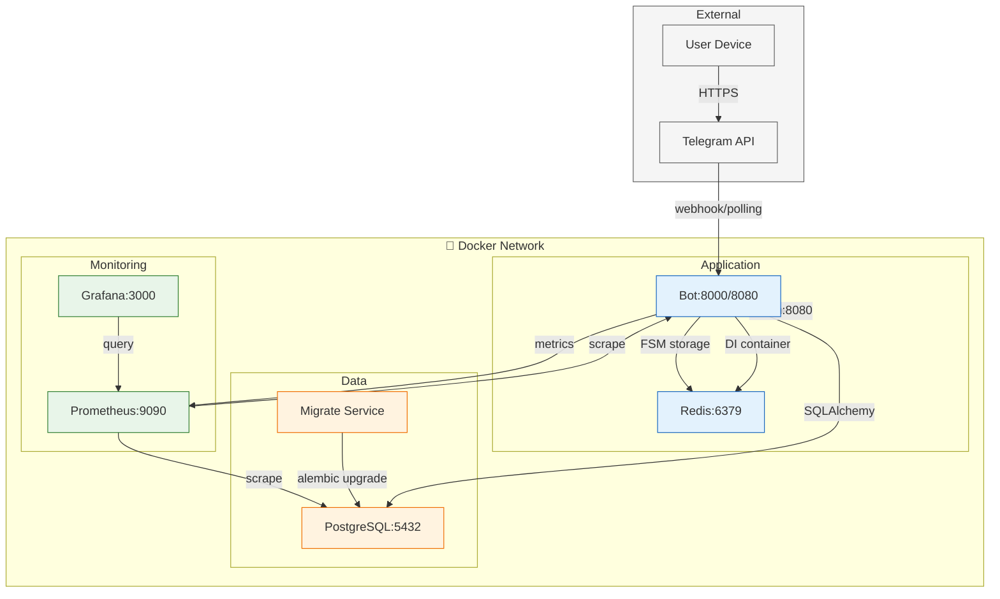
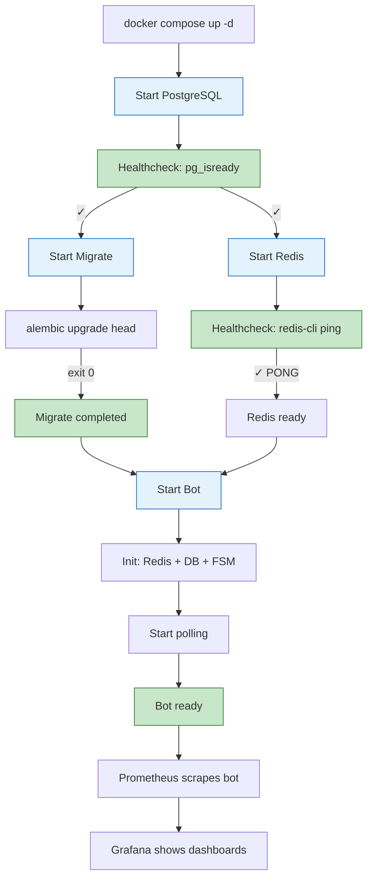

# Архитектура Docker Compose

## Сервисы и зависимости

```mermaid
flowchart TB
    subgraph External["External"]
        TG[Telegram API]
        User[User Device]
    end

    subgraph Docker["🐳 Docker Network"]
        direction TB
        
        subgraph Monitoring["Monitoring"]
            Grafana[Grafana:3000]
            Prometheus[Prometheus:9090]
        end
        
        subgraph App["Application"]
            Bot[Bot:8000/8080]
            Redis[Redis:6379]
        end
        
        subgraph Data["Data"]
            Postgres[PostgreSQL:5432]
            Migrate[Migrate Service]
        end
    end

    User -->|HTTPS| TG
    TG -->|webhook/polling| Bot
    
    Bot -->|metrics| Prometheus
    Prometheus -->|scrape| Bot
    Prometheus -->|scrape| Postgres
    
    Grafana -->|query| Prometheus
    
    Bot -->|FSM storage| Redis
    Bot -->|DI container| Redis
    
    Migrate -->|alembic upgrade| Postgres
    Bot -->|SQLAlchemy| Postgres
    
    Bot -.->|health:8080| Docker
    
    classDef external fill:#f5f5f5,stroke:#616161
    classDef monitoring fill:#e8f5e9,stroke:#2e7d32
    classDef app fill:#e3f2fd,stroke:#1565c0
    classDef data fill:#fff3e0,stroke:#ef6c00
    
    class External,TG,User external
    class Grafana,Prometheus monitoring
    class Bot,Redis app
    class Postgres,Migrate data
```

## Порядок запуска

```mermaid
graph TD
    Start[docker compose up -d] --> PG_Start[Start PostgreSQL]
    PG_Start --> PG_HC[Healthcheck: pg_isready]
    PG_HC -->|✓| Migrate_Start[Start Migrate]
    Migrate_Start --> Migrate_Run[alembic upgrade head]
    Migrate_Run -->|exit 0| Migrate_Done[Migrate completed]
    
    PG_HC -->|✓| Redis_Start[Start Redis]
    Redis_Start --> Redis_HC[Healthcheck: redis-cli ping]
    Redis_HC -->|✓ PONG| Redis_Ready[Redis ready]
    
    Migrate_Done --> Bot_Start[Start Bot]
    Redis_Ready --> Bot_Start
    
    Bot_Start --> Bot_Init[Init: Redis + DB + FSM]
    Bot_Init --> Bot_Poll[Start polling]
    Bot_Poll --> Ready[Bot ready]
    
    Ready --> Prometheus_Start[Prometheus scrapes bot]
    Prometheus_Start --> Grafana_Start[Grafana shows dashboards]
    
    classDef success fill:#c8e6c9,stroke:#2e7d32
    classDef process fill:#e3f2fd,stroke:#1565c0
    
    class PG_HC,Redis_HC,Migrate_Done,Ready success
    class PG_Start,Migrate_Start,Redis_Start,Bot_Start process
```