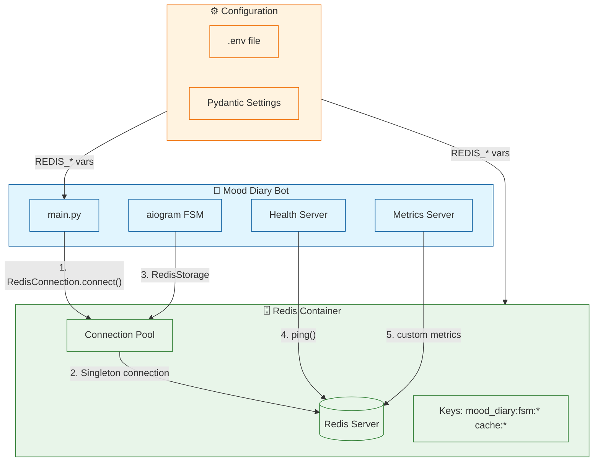
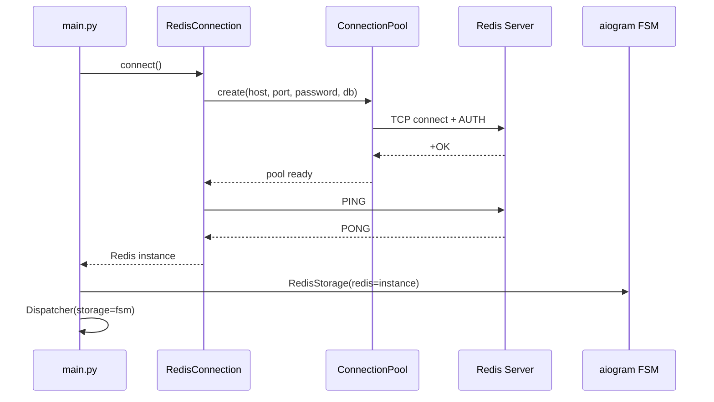
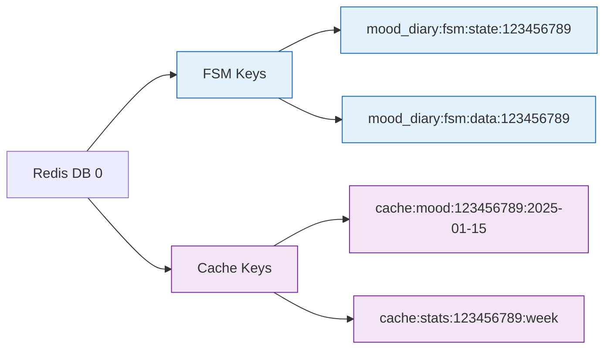
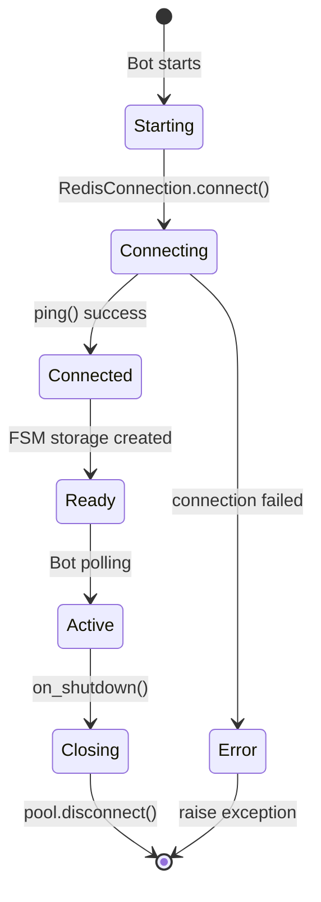

# 🔗 Архитектура подключения к Redis

## Обзор

```mermaid
flowchart TB
    subgraph App["🤖 Mood Diary Bot"]
        Main[main.py]
        FSM[aiogram FSM]
        Health[Health Server]
        Metrics[Metrics Server]
    end

    subgraph Redis["🗄️ Redis Container"]
        RedisServer[(Redis Server)]
        RedisPool[Connection Pool]
        Keys["Keys: mood_diary:fsm:* cache:*"]
    end

    subgraph Config["⚙️ Configuration"]
        Env[.env file]
        Settings[Pydantic Settings]
    end

    Main -->|"1. RedisConnection.connect()"| RedisPool
    RedisPool -->|"2. Singleton connection"| RedisServer
    FSM -->|"3. RedisStorage"| RedisPool
    Health -->|"4. ping()"| RedisServer
    Metrics -->|"5. custom metrics"| RedisServer
    
    Config -->|"REDIS_* vars"| Main
    Config -->|"REDIS_* vars"| Redis

    classDef app fill:#e1f5fe,stroke:#01579b
    classDef redis fill:#e8f5e9,stroke:#2e7d32
    classDef config fill:#fff3e0,stroke:#ef6c00
    
    class App,Main,FSM,Health,Metrics app
    class Redis,RedisServer,RedisPool,Keys redis
    class Config,Env,Settings config
```

## Поток инициализации

```mermaid
sequenceDiagram
    participant Main as main.py
    participant RedisConn as RedisConnection
    participant Pool as ConnectionPool
    participant Redis as Redis Server
    participant FSM as aiogram FSM

    Main->>RedisConn: connect()
    RedisConn->>Pool: create(host, port, password, db)
    Pool->>Redis: TCP connect + AUTH
    Redis-->>Pool: +OK
    Pool-->>RedisConn: pool ready
    RedisConn->>Redis: PING
    Redis-->>RedisConn: PONG
    RedisConn-->>Main: Redis instance
    Main->>FSM: RedisStorage(redis=instance)
    Main->>Main: Dispatcher(storage=fsm)
```

## Ключи в Redis

```mermaid
graph LR
    Root[Redis DB 0] --> FSM_Keys[FSM Keys]
    Root --> Cache[Cache Keys]
    
    FSM_Keys --> State["mood_diary:fsm:state:123456789"]
    FSM_Keys --> Data["mood_diary:fsm:data:123456789"]
    
    Cache --> MoodCache["cache:mood:123456789:2025-01-15"]
    Cache --> StatsCache["cache:stats:123456789:week"]

    classDef fsm fill:#e3f2fd,stroke:#1565c0
    classDef cache fill:#f3e5f5,stroke:#7b1fa2
    
    class FSM_Keys,State,Data fsm
    class Cache,MoodCache,StatsCache cache
```

## Жизненный цикл подключения

```mermaid
stateDiagram-v2
    [*] --> Starting: Bot starts
    Starting --> Connecting: RedisConnection.connect()
    Connecting --> Connected: ping() success
    Connected --> Ready: FSM storage created
    Ready --> Active: Bot polling
    Active --> Closing: on_shutdown()
    Closing --> [*]: pool.disconnect()
    
    Connecting --> Error: connection failed
    Error --> [*]: raise exception
```